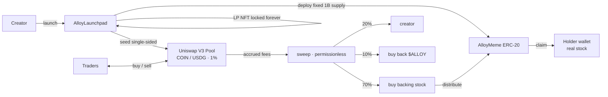
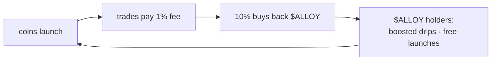

<p align="center">
  
</p>

<h1 align="center">Alloy</h1>

<p align="center"><strong>Dividend memecoins backed by real tokenized stocks.</strong></p>

<p align="center">
  <a href="https://alloy.fund">alloy.fund</a> ·
  <a href="https://x.com/AlloyRH">@AlloyRH</a> ·
  <a href="https://robinhoodchain.blockscout.com/address/0x927750E6EebAD299EFDb88f37F830BAD27b0657e">Launchpad</a>
</p>

<p align="center">
  
  
  
  
</p>

---

## Overview

Alloy is a launchpad on [Robinhood Chain](https://robinhood.com/us/en/chain/) for a token type that did not previously exist: a **memecoin that pays its holders in real equity**.

Every coin launched on Alloy is bound at deploy time to one real, Robinhood-issued **tokenized stock**. Every trade against that coin pays a 1% pool fee. A permissionless keeper converts those fees into the backing stock and distributes it to holders pro-rata. Holding the coin passively accrues real NVDA, TSLA, or AAPL, claimable to your wallet at any time.

There is no oracle, no custodian, no off-chain accounting, and no admin key over user funds. The distribution is an on-chain invariant.

```
hold coin -> coin trades -> 1% fee -> buys real stock -> drips to holders -> claim to wallet
```

## How it works



### 1. Launch

`launch()` performs the entire lifecycle in a single transaction:

1. Deploys an `AlloyMeme` ERC-20 via `CREATE2` with a fixed 1,000,000,000 supply and no mint function.
2. Opens a Uniswap V3 pool against **USDG** at the 1% fee tier.
3. Seeds the **entire supply** as single-sided liquidity above spot, so the pool opens holding only the coin.
4. Retains the LP position permanently. The position is never transferable out — liquidity cannot be pulled.
5. Excludes the pool, the launchpad, and the burn address from dividend accounting, so drips only ever reach real holders.

The launch price is deterministic. The pool is initialised at a precomputed `sqrtPriceX96` derived from `startTick = 398400`, which on an 18-decimal coin against 6-decimal USDG yields an opening fully-diluted valuation of approximately **$5,000**.

$$P_{\text{launch}} = 1.0001^{-398400} \times 10^{18-6} \approx 5.0 \times 10^{-6}\ \text{USDG}$$

### 2. Sweep

`sweep(token)` is permissionless and can be called by anyone:

1. Collects accrued fees from the locked LP position (both sides).
2. Sells the coin-denominated side into USDG so all routing happens in dollars.
3. Splits the USDG per the fee schedule below.
4. Buys the backing stock with the drip share and credits it to holders.

### 3. Fee schedule

| Share | Basis points | Destination |
| --- | ---: | --- |
| Drip | 7000 | Buys the backing stock, distributed to holders |
| Creator | 2000 | Paid to the launcher in USDG |
| Protocol | 1000 | Buys back `$ALLOY` |

Configurable by the owner via `setFeeSplit`, constrained to sum to exactly `10_000`.

## The drip: dividend accounting

`AlloyMeme` implements a magnified per-share accumulator, a well-understood pattern for constant-time pro-rata distribution regardless of holder count. Distribution is **O(1)**; there is no iteration over holders and therefore no gas ceiling on the holder set.

Let $S$ be the eligible supply (total supply minus excluded balances) and $A$ the reward amount being distributed:

$$\text{magPerShare} \mathrel{+}= \left\lfloor \frac{A \cdot 2^{128}}{S} \right\rfloor$$

Each account's lifetime entitlement is its balance scaled by the accumulator, corrected for balance changes that occurred at different accumulator values:

$$\text{accrued}(a) = \left\lfloor \frac{\text{magPerShare} \cdot \text{balance}(a) + \text{corrections}(a)}{2^{128}} \right\rfloor$$

$$\text{claimable}(a) = \text{accrued}(a) - \text{withdrawn}(a)$$

On every transfer of value $v$, corrections are adjusted so that historical entitlement is preserved:

```
from:  corrections[from] += magPerShare * v      (balance fell)
to:    corrections[to]   -= magPerShare * v      (balance rose)
```

The $2^{128}$ magnitude preserves precision for dust-sized distributions against a 1e27-wei eligible supply, and the accumulator cannot realistically overflow a `uint256`.

### Exclusions

Addresses excluded from dividends (the AMM pool, the launchpad, the burn address) are removed from `eligibleSupply`. Without this, the pool — which holds most of the supply at launch — would absorb the majority of every drip and strand it permanently. Exclusions are only settable by the factory and only while `magPerShare == 0`, so no accrued balance can ever be confiscated.

## The $ALLOY flywheel

`$ALLOY` captures fees from every coin on the launchpad.



| Utility | Mechanism |
| --- | --- |
| Fee capture | 10% of every coin's trading fees buys `$ALLOY` on-chain |
| Free launches | Holding `freeLaunchThreshold` waives the creation fee |
| Boosted drips | Elevated share of distributed stock |

## Deployments

Robinhood Chain — chain ID **4663**.

| Contract | Address |
| --- | --- |
| AlloyLaunchpad | [`0x927750E6EebAD299EFDb88f37F830BAD27b0657e`](https://robinhoodchain.blockscout.com/address/0x927750E6EebAD299EFDb88f37F830BAD27b0657e) |
| $ALLOY | [`0x3d85d3e14cE83924CcD1eFcd3416DD6b3d8c2C25`](https://robinhoodchain.blockscout.com/address/0x3d85d3e14cE83924CcD1eFcd3416DD6b3d8c2C25) |
| USDG (quote asset) | [`0x5fc5360D0400a0Fd4f2af552ADD042D716F1d168`](https://robinhoodchain.blockscout.com/address/0x5fc5360D0400a0Fd4f2af552ADD042D716F1d168) |
| Uniswap V3 Factory | `0x1f7d7550B1b028f7571E69A784071F0205FD2EfA` |
| NonfungiblePositionManager | `0x73991a25c818bf1f1128deaab1492d45638de0d3` |
| SwapRouter02 | `0xcaf681a66d020601342297493863e78c959e5cb2` |

All protocol contracts are verified on Blockscout.

## Security properties

| Property | Guarantee |
| --- | --- |
| Liquidity | The LP position is minted to the launchpad and never transferred out. Liquidity is permanently locked. |
| Supply | Fixed at 1,000,000,000 at construction. `AlloyMeme` exposes no mint path and no owner. |
| Custody | Non-custodial. Coins and drips settle directly between the pool, the token, and holder wallets. |
| Distribution solvency | `distribute()` only credits reward already delivered to the contract, so the sum of claims can never exceed the balance held. |
| Confiscation | Exclusions are factory-only and rejected once distribution has begun (`magPerShare != 0`). |
| Admin scope | The owner can set the fee split, creation fee, treasury, and `$ALLOY` config. The owner cannot mint, pause, seize balances, or touch the LP. |
| Backing integrity | The backing stock is immutable per coin, bound at construction. |

### Known trade-offs

- `sweep()` routes swaps with `amountOutMinimum = 0`. Amounts are fee-sized, but this is MEV-exposed by construction; the alternative is a stale on-chain price oracle for an asset with intentionally thin liquidity.
- Only tokenized stocks with a live USDG pool can back a coin. The interface enforces this at launch time.
- Drips accrue only to non-excluded holders. Coins held inside another contract that does not forward claims will accrue to that contract.

## Repository layout

```
contracts/
  AlloyMeme.sol            dividend-paying ERC-20; magnified per-share accounting
  AlloyLaunchpad.sol       launch, single-sided seeding, LP lock, fee sweep
  interfaces/IUniswap.sol  minimal Uniswap V3 surface consumed by the protocol
docs/
  architecture.md          system design and control flow
  mechanism.md             distribution math and launch pricing derivation
  security.md              invariants, threat model, trade-offs
abis/                      ABIs for integrators
```

## Integration

A Uniswap-standard token list of every launched coin is served at:

```
https://alloy.fund/tokenlist.json
```

Per-coin metadata and logos:

```
https://alloy.fund/api/token/{address}
https://alloy.fund/api/logo/{address}
```

## Build

```bash
npm install
npx hardhat compile
npx hardhat test
```

Solidity 0.8.26, optimizer enabled (200 runs), `viaIR`. The launch path builds its Uniswap mint parameters into a memory struct with straight-line assignment rather than nested ternaries; the IR pipeline's stack scheduler will not otherwise resolve the function.

## License

MIT


